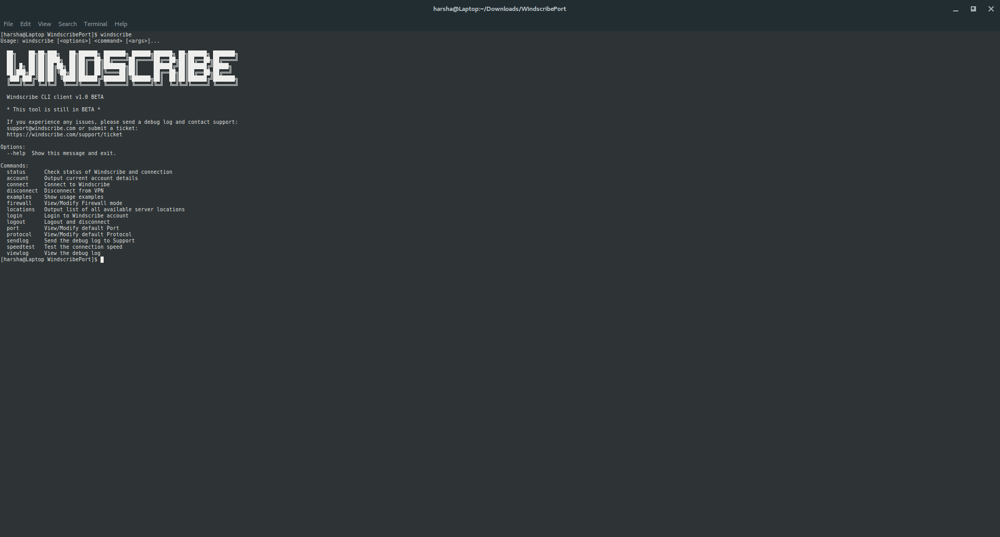

## Windscribe VPN CLI for Arch Linux

**Update: You can now install this package from [AUR](https://aur.archlinux.org/packages/windscribe-cli/)**

### Overview
This repository contains the files necessary to build Windscribe VPN CLI for Arch Linux. Currently, Windscribe's CLI is in open beta, so users should anticipate breakages.

### Installation

#### Installing From AUR
- You install this package from the Arch User Repository (AUR) by using `yaourt` and running `yaourt -S windscribe-cli`.

#### Installing From Source
In order the install Windscribe's CLI from source, use the following instructions:

1. Clone this repository onto your local machine.
2. `cd` into the cloned repository.
3. Execute `makepkg -cs` to build the package.
4. After the build process is finished, run `sudo pacman -U windscribe-cli-1.0-1-any.pkg.tar` to install the package.

### Running Windscribe CLI
1. After installing for the first time, close out of any active terminals (this is so that bash autocomplete works)
2. Check to see if the windscribe daemon is running: `systemctl status windscribe.service`
3. If the daemon is not running, you can simply run `sudo systemctl start windscribe`. (If you want the daemon to automatically start on boot, you can run `sudo systemctl enable windscribe`, otherwise you will have to execute `sudo systemctl start windscribe` every time the computer is booted)
4. Now running `windscribe` in your terminal should bring-up the CLI
5. To login to windscribe, run `windscribe login`
6. To connect to windscribe, run `windscribe connect`
7. If you need additional help, run `windscribe --help`

### Resources
[Windscribe](https://windscribe.com/)

[Windscribe Linux Download](https://windscribe.com/guides/linux)
